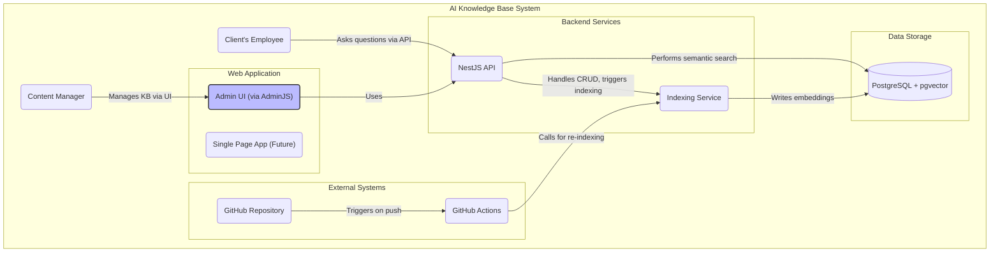
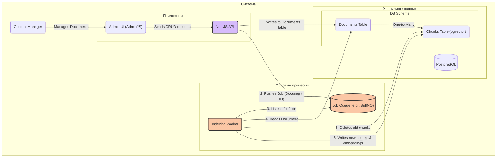
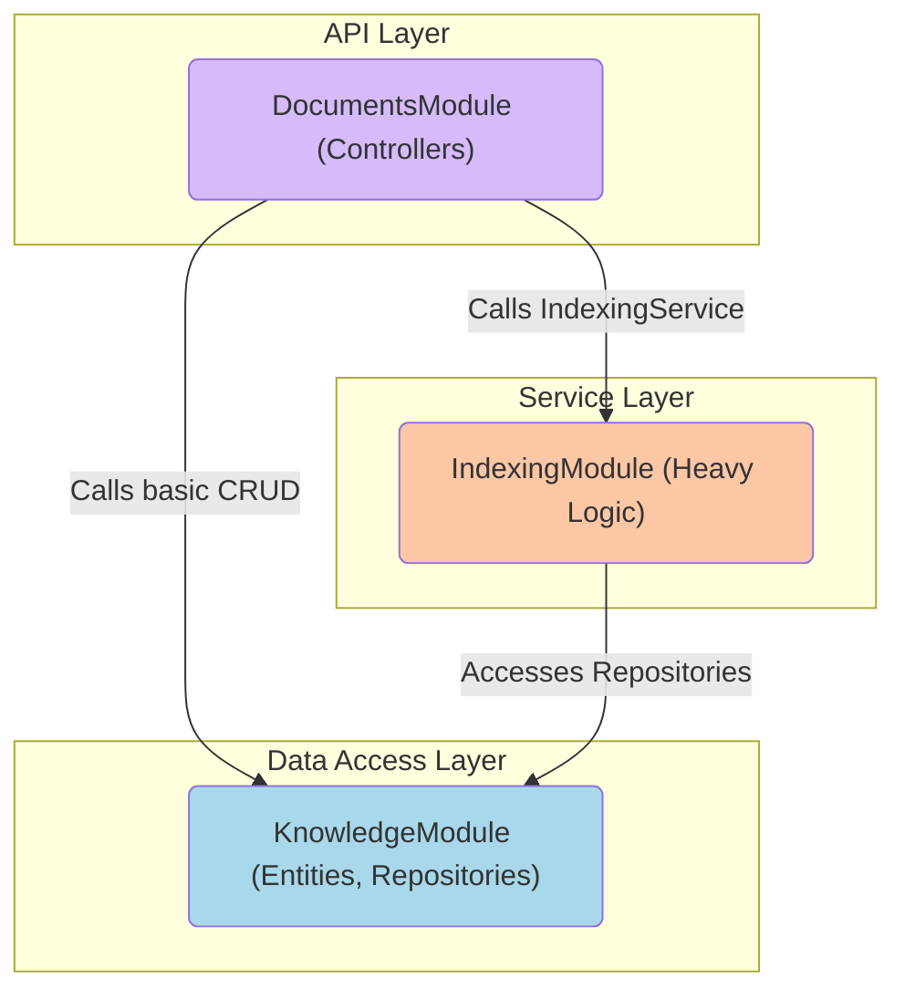
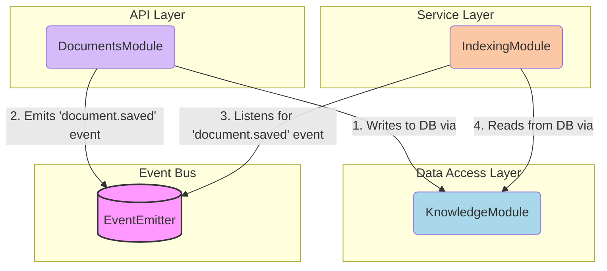
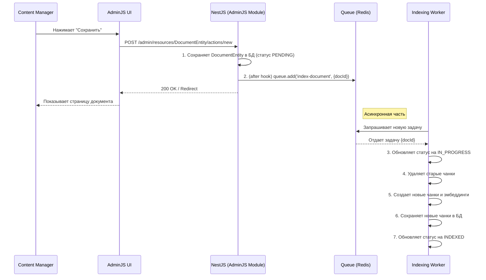
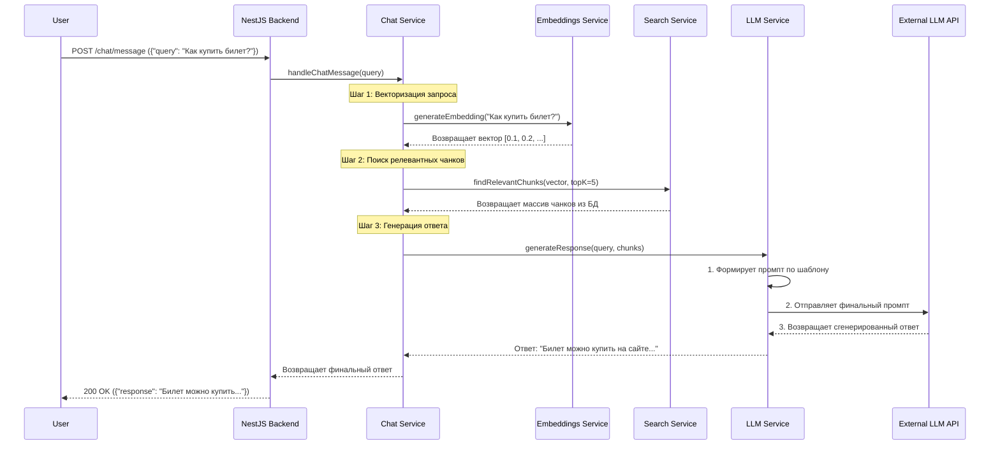
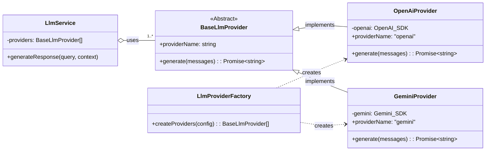
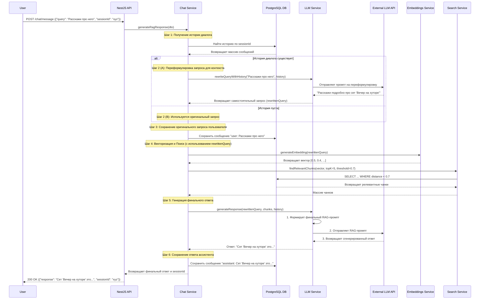

```mermaid
graph TD
    subgraph "AI Knowledge Base System"
        user("Client's Employee")
        admin("Content Manager")

        subgraph "Web Application"
            spa("Single Page App (Future)")
            adminUI("Admin UI (via AdminJS)")
        end

        subgraph "Backend Services"
            api("NestJS API")
            indexer("Indexing Service")
        end

        subgraph "Data Storage"
            db[("PostgreSQL + pgvector")]
        end

        subgraph "External Systems"
            gh("GitHub Repository")
            actions("GitHub Actions")
        end
    end

    user -- "Asks questions via API" --> api
    admin -- "Manages KB via UI" --> adminUI
    adminUI -- "Uses" --> api

    api -- "Handles CRUD, triggers indexing" --> indexer
    api -- "Performs semantic search" --> db
    indexer -- "Writes embeddings" --> db

    gh -- "Triggers on push" --> actions
    actions -- "Calls for re-indexing" --> indexer

    style adminUI fill:#bbf,stroke:#333,stroke-width:2px
```

```mermaid
graph TD
    subgraph "Система"
        admin("Content Manager")

        subgraph "Приложение"
            adminUI("Admin UI (AdminJS)")
            api("NestJS API")
        end

        subgraph "Фоновые процессы"
            queue[("Job Queue (e.g., BullMQ)")]
            worker("Indexing Worker")
        end

        subgraph "Хранилище данных"
            db[("PostgreSQL")]
            subgraph "DB Schema"
                docTbl("Documents Table")
                chunkTbl("Chunks Table (pgvector)")
            end
        end
    end

    admin -- "Manages Documents" --> adminUI
    adminUI -- "Sends CRUD requests" --> api

    api -- "1. Writes to Documents Table" --> docTbl
    api -- "2. Pushes Job (Document ID)" --> queue

    worker -- "3. Listens for Jobs" --> queue
    worker -- "4. Reads Document" --> docTbl
    worker -- "5. Deletes old chunks" --> chunkTbl
    worker -- "6. Writes new chunks & embeddings" --> chunkTbl

    docTbl -- "One-to-Many" --> chunkTbl

    style api fill:#d6bbfb,stroke:#333,stroke-width:2px
    style worker fill:#fbc7a5,stroke:#333,stroke-width:2px
    style queue fill:#fbc7a5,stroke:#333,stroke-width:2px
```


```mermaid
graph TD
    subgraph "API Layer"
        DocumentsModule("DocumentsModule (Controllers)")
    end

    subgraph "Service Layer"
        IndexingModule("IndexingModule (Heavy Logic)")
    end

    subgraph "Data Access Layer"
        KnowledgeModule("KnowledgeModule (Entities, Repositories)")
    end

    DocumentsModule -- "Calls IndexingService" --> IndexingModule
    DocumentsModule -- "Calls basic CRUD" --> KnowledgeModule
    IndexingModule -- "Accesses Repositories" --> KnowledgeModule

    style DocumentsModule fill:#d6bbfb
    style IndexingModule fill:#fbc7a5
    style KnowledgeModule fill:#a8d8ea
```


```mermaid
graph TD
    subgraph "API Layer"
        DocumentsModule("DocumentsModule")
    end

    subgraph "Service Layer"
        IndexingModule("IndexingModule")
    end

    subgraph "Data Access Layer"
        KnowledgeModule("KnowledgeModule")
    end

    subgraph "Event Bus"
        EventBus[("EventEmitter")]
    end

    DocumentsModule -- "1. Writes to DB via" --> KnowledgeModule
    DocumentsModule -- "2. Emits 'document.saved' event" --> EventBus
    IndexingModule -- "3. Listens for 'document.saved' event" --> EventBus
    IndexingModule -- "4. Reads from DB via" --> KnowledgeModule

    style DocumentsModule fill:#d6bbfb
    style IndexingModule fill:#fbc7a5
    style KnowledgeModule fill:#a8d8ea
    style EventBus fill:#f9f,stroke:#333,stroke-width:2px
```


```mermaid
graph TD
    subgraph "API Layer"
        DocumentsModule("DocumentsModule")
    end

    subgraph "Service Layer"
        IndexingModule("IndexingModule")
    end

    subgraph "Data Access Layer"
        KnowledgeModule("KnowledgeModule")
    end

    subgraph "Event Bus"
        EventBus[("EventEmitter")]
    end

    DocumentsModule -- "1. Writes to DB via" --> KnowledgeModule
    DocumentsModule -- "2. Emits 'document.saved' event" --> EventBus
    IndexingModule -- "3. Listens for 'document.saved' event" --> EventBus
    IndexingModule -- "4. Reads from DB via" --> KnowledgeModule

    style DocumentsModule fill:#d6bbfb
    style IndexingModule fill:#fbc7a5
    style KnowledgeModule fill:#a8d8ea
    style EventBus fill:#f9f,stroke:#333,stroke-width:2px
```


```mermaid
sequenceDiagram
    participant CM as Content Manager
    participant AdminJS_UI as AdminJS UI
    participant AdminJS_Backend as NestJS (AdminJS Module)
    participant BullMQ as Queue (Redis)
    participant IndexingWorker as Indexing Worker

    CM->>AdminJS_UI: Нажимает "Сохранить"
    AdminJS_UI->>AdminJS_Backend: POST /admin/resources/DocumentEntity/actions/new
    AdminJS_Backend->>AdminJS_Backend: 1. Сохраняет DocumentEntity в БД (статус PENDING)
    AdminJS_Backend->>BullMQ: 2. (after hook) queue.add('index-document', {docId})
    AdminJS_Backend-->>AdminJS_UI: 200 OK / Redirect
    AdminJS_UI-->>CM: Показывает страницу документа

    Note right of BullMQ: Асинхронная часть

    IndexingWorker->>BullMQ: Запрашивает новую задачу
    BullMQ-->>IndexingWorker: Отдает задачу {docId}
    IndexingWorker->>IndexingWorker: 3. Обновляет статус на IN_PROGRESS
    IndexingWorker->>IndexingWorker: 4. Удаляет старые чанки
    IndexingWorker->>IndexingWorker: 5. Создает новые чанки и эмбеддинги
    IndexingWorker->>IndexingWorker: 6. Сохраняет новые чанки в БД
    IndexingWorker->>IndexingWorker: 7. Обновляет статус на INDEXED
```


```mermaid
sequenceDiagram
    participant User
    participant API_Gateway as NestJS Backend
    participant ChatService as Chat Service
    participant EmbeddingsService as Embeddings Service
    participant SearchService as Search Service
    participant LlmService as LLM Service
    participant ExternalLLM as External LLM API

    User->>API_Gateway: POST /chat/message ({"query": "Как купить билет?"})
    API_Gateway->>ChatService: handleChatMessage(query)

    Note over ChatService: Шаг 1: Векторизация запроса
    ChatService->>EmbeddingsService: generateEmbedding("Как купить билет?")
    EmbeddingsService-->>ChatService: Возвращает вектор [0.1, 0.2, ...]

    Note over ChatService: Шаг 2: Поиск релевантных чанков
    ChatService->>SearchService: findRelevantChunks(vector, topK=5)
    SearchService-->>ChatService: Возвращает массив чанков из БД

    Note over ChatService: Шаг 3: Генерация ответа
    ChatService->>LlmService: generateResponse(query, chunks)
    LlmService->>LlmService: 1. Формирует промпт по шаблону
    LlmService->>ExternalLLM: 2. Отправляет финальный промпт
    ExternalLLM-->>LlmService: 3. Возвращает сгенерированный ответ
    LlmService-->>ChatService: Ответ: "Билет можно купить на сайте..."

    ChatService-->>API_Gateway: Возвращает финальный ответ
    API_Gateway-->>User: 200 OK ({"response": "Билет можно купить..."})
```


```mermaid
classDiagram
    direction LR

    class LlmService {
        -providers: BaseLlmProvider[]
        +generateResponse(query, context)
    }

    class BaseLlmProvider {
        <<Abstract>>
        +providerName: string
        +generate(messages): Promise~string~
    }

    class OpenAiProvider {
        -openai: OpenAI_SDK
        +providerName: "openai"
        +generate(messages): Promise~string~
    }

    class GeminiProvider {
        -gemini: Gemini_SDK
        +providerName: "gemini"
        +generate(messages): Promise~string~
    }

    class LlmProviderFactory {
        +createProviders(config): BaseLlmProvider[]
    }

    LlmService o-- "1..*" BaseLlmProvider : uses
    BaseLlmProvider <|-- OpenAiProvider : implements
    BaseLlmProvider <|-- GeminiProvider : implements
    LlmProviderFactory ..> OpenAiProvider : creates
    LlmProviderFactory ..> GeminiProvider : creates
```


```mermaid
sequenceDiagram
    participant User
    participant NestJS_API as NestJS API
    participant ChatService as Chat Service
    participant PostgreSQL_DB as PostgreSQL DB
    participant LlmService as LLM Service
    participant ExternalLLM as External LLM API
    participant EmbeddingsService as Embeddings Service
    participant SearchService as Search Service

    User->>NestJS_API: POST /chat/message ({"query": "Расскажи про него", "sessionId": "xyz"})
    NestJS_API->>ChatService: generateRagResponse(dto)

    Note over ChatService: Шаг 1: Получение истории диалога
    ChatService->>PostgreSQL_DB: Найти историю по sessionId
    PostgreSQL_DB-->>ChatService: Возвращает массив сообщений

    alt История диалога существует
        Note over ChatService: Шаг 2 (A): Переформулировка запроса для контекста
        ChatService->>LlmService: rewriteQueryWithHistory("Расскажи про него", history)
        LlmService->>ExternalLLM: Отправляет промпт на переформулировку
        ExternalLLM-->>LlmService: "Расскажи подробно про сет 'Вечер на хуторе'"
        LlmService-->>ChatService: Возвращает самостоятельный запрос (rewrittenQuery)
    else История пуста
        Note over ChatService: Шаг 2 (B): Используется оригинальный запрос
    end

    Note over ChatService: Шаг 3: Сохранение оригинального запроса пользователя
    ChatService->>PostgreSQL_DB: Сохранить сообщение "user: Расскажи про него"

    Note over ChatService: Шаг 4: Векторизация и Поиск (с использованием rewrittenQuery)
    ChatService->>EmbeddingsService: generateEmbedding(rewrittenQuery)
    EmbeddingsService-->>ChatService: Возвращает вектор [0.5, 0.4, ...]
    ChatService->>SearchService: findRelevantChunks(vector, topK=5, threshold=0.7)
    SearchService->>PostgreSQL_DB: SELECT ... WHERE distance < 0.7
    PostgreSQL_DB-->>SearchService: Возвращает релевантные чанки
    SearchService-->>ChatService: Массив чанков

    Note over ChatService: Шаг 5: Генерация финального ответа
    ChatService->>LlmService: generateResponse(rewrittenQuery, chunks, history)
    LlmService->>LlmService: 1. Формирует финальный RAG-промпт
    LlmService->>ExternalLLM: 2. Отправляет RAG-промпт
    ExternalLLM-->>LlmService: 3. Возвращает сгенерированный ответ
    LlmService-->>ChatService: Ответ: "Сет 'Вечер на хуторе' это..."

    Note over ChatService: Шаг 6: Сохранение ответа ассистента
    ChatService->>PostgreSQL_DB: Сохранить сообщение "assistant: Сет 'Вечер на хуторе' это..."

    ChatService-->>NestJS_API: Возвращает финальный ответ и sessionId
    NestJS_API-->>User: 200 OK ({"response": "Сет 'Вечер на хуторе' это...", "sessionId": "xyz"})
```

```mermaid
```

```mermaid
```

```mermaid
```
